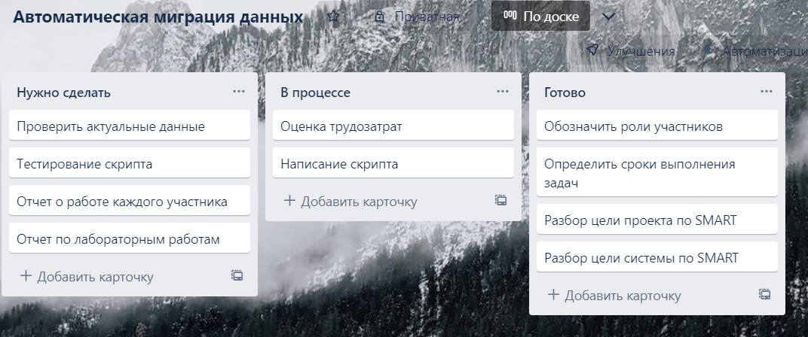

Выполнение ЛР1</h1>

1.1 Рассматриваемая система (процесс)

1.1.1 Наименование: Процесс ручной миграции данных

1.1.2 Цель (назначение): Актуализация данных

1.1.3 Разбор цели системы по SMART

<table role="table">
<thead>
<tr>
<th>Критерий</th>
<th align="center">Значение</th>
<th align="right">Оценка</th>
</tr>
</thead>
<tbody>
<tr>
<td>S (конкретность)</td>
<td align="center">Ручная миграция</td>
<td align="right">+ или -</td>
</tr>
<tr>
<td>М (измеримость)</td>
<td align="center">Количество записей</td>
<td align="right">+ или -</td>
</tr>
<tr>
<td>А (достижимость)</td>
<td align="center">Команда проекта, средства разработки</td>
<td align="right">+ или -</td>
</tr>
<tr>
<td>R (уместность)</td>
<td align="center">Инструментальное ПО</td>
<td align="right">+ или -</td>
</tr>
<tr>
<td>Т (ограниченность во времени)</td>
<td align="center">До конца 2 модуля</td>
<td align="right">+ или -</td>
</tr>
</tbody>
</table>

1.2 Предлагаемый проект

1.2.1 Наименование: Процесс автоматической миграции данных

1.2.2 Цель (изменяемый критерий SMART цели системы): Упрощение и автоматизация процесса миграции данных

<table role="table">
<thead>
<tr>
<th>Критерий</th>
<th align="center">Значение</th>
<th align="right">Оценка</th>
</tr>
</thead>
<tbody>
<tr>
<td>S (конкретность)</td>
<td align="center">Автоматическая миграция</td>
<td align="right">+ или -</td>
</tr>
<tr>
<td>М (измеримость)</td>
<td align="center">Количество актуальных записей</td>
<td align="right">+ или -</td>
</tr>
<tr>
<td>А (достижимость)</td>
<td align="center">Команда проекта/LIGA</td>
<td align="right">+ или -</td>
</tr>
<tr>
<td>R (уместность)</td>
<td align="center">Ограничение: 9 часов на каждого участника команды</td>
<td align="right">+ или -</td>
</tr>
<tr>
<td>Т (ограниченность во времени)</td>
<td align="center">До конца 2 модуля</td>
<td align="right">+ или -</td>
</tr>
</tbody>
</table>

<strong>1.2.4 Оценка трудозатрат</strong>

<table role="table">
<thead>
<tr>
<th>Критерий</th>
<th align="center">Значение</th>
<th align="right">Плановая</th>
<th>Фактическая</th>
</tr>
</thead>
<tbody>
<tr>
<td>РП (Владелец продукта)</td>
<td align="center">Регистрирует участников проекта</td>
<td align="right">25 мин</td>
<td>15 мин</td>
</tr>
<tr>
<td>РП (Владелец продукта)</td>
<td align="center">Принимает решение по всем возникающим проблемам</td>
<td align="right">45 мин</td>
<td>30 мин</td>
</tr>
<tr>
<td>РП (Владелец продукта)</td>
<td align="center">Принимает решение об успешности спринта, дает общую оценку работы команды и дает предложения по всем индивидуальным оценкам</td>
<td align="right">30 мин</td>
<td>30 мин</td>
</tr>
<tr>
<td>АД (Мастер)</td>
<td align="center">Получает оценку времени для каждой подзадачи, собирает sprint log, назначает исполнителей</td>
<td align="right">25 мин</td>
<td>15 мин</td>
</tr>
<tr>
<td>АД (Мастер)</td>
<td align="center">Проводит stand-up совещание</td>
<td align="right">90 мин * 5 (5 собраний)</td>
<td>120 мин * 5</td>
</tr>
<tr>
<td>АД (Мастер)</td>
<td align="center">Проводит демонстрацию результатов спринта владельцу продукта и другим заинтересованным лицам</td>
<td align="right">30 мин</td>
<td>35 мин</td>
</tr>
<tr>
<td>СП (Аналитик)</td>
<td align="center">Регистрирует возникающие дополнительные задачи (issue) в соответствующих проектах</td>
<td align="right">15 мин * 2</td>
<td>15 мин *2</td>
</tr>
<tr>
<td>СП (Аналитик)</td>
<td align="center">Выполняет все разработанные тесты, регистрирует все выявленные несоответствия требованиям</td>
<td align="right">60 мин</td>
<td>60 мин</td>
</tr>
<tr>
<tr>
<td>БА (Тестировщик)</td>
<td align="center">Разрабатывает процедуры - тесты и тестовые наборы данных</td>
<td align="right">110 мин</td>
<td>110 мин</td>
</tr>
<tr>
<td>БА (Тестировщик)</td>
<td align="center">Тестирует внедренное ПО в среде</td>
<td align="right">30 мин</td>
<td>30 мин</td>
</tr>
<tr>
<td>НИ (Архитектор)</td>
<td align="center">Определяет дополнительные требования к выполнению задач</td>
<td align="right">60 мин</td>
<td>60 мин</td>
</tr>
<tr>
<td>НИ (Архитектор)</td>
<td align="center">Решает возникающие несоответствия при наладке системы на физическом уровне</td>
<td align="right">40 мин</td>
<td>40 мин</td>
</tr>
<tr>
<td>НИ (Архитектор)</td>
<td align="center">Принимает решение по всем выявленных несоответствиям требованиям</td>
<td align="right">20 мин</td>
<td>15 мин</td>
</tr>
<tr>
<td>ПП (Программист)</td>
<td align="center">Интегрирует с помощью кода готовое ПО в среду системы, по необходимости дописывает процедуры и функции для успешного внедрения ПО в систему</td>
<td align="right">100 мин</td>
<td>100 мин</td>
</tr>
<tr>
<td>ПП (Программист)</td>
<td align="center">Выполняет корректирующие действия по ПО на основе тестов</td>
<td align="right">90 мин</td>
<td>90 мин</td>
</tr>
<tr>
<td>ПП (Программист)</td>
<td align="center">Разрабатывает алгоритмы выполнения всех подзадач, требующих программной реализации</td>
<td align="right">60 мин</td>
<td>60 мин</td>
</tr>
<tr>
<td>КО (Тех.писатель)</td>
<td align="center">Делает описания для всех подзадач, требующих корректировки</td>
<td align="right">20 мин</td>
<td>20 мин</td>
</tr>
<tr>
<td>КО (Тех.писатель)</td>
<td align="center">Корректирует или делает новые описания для всех разработанных процедур</td>
<td align="right">20 мин</td>
<td>20 мин</td>
</tr>
<tr>
<td>КО (Тех.писатель)</td>
<td align="center">Разрабатывает требуемые описания всех разработанных процедур, тестов и тестовых наборов данных, разрабатывает документацию (руководство пользователя)</td>
<td align="right">50 мин</td>
<td>50 мин</td>
</tr>
</tbody>
</table>

<strong>1.2.5 Основной поток</strong>

<table role="table">
<thead>
<tr>
<th>Участник</th>
<th align="center">Действие (activity)</th>
<th>Ожидаемый результат</th>
</tr>
</thead>
<tbody>
<tr>
<td>АД (Мастер)</td>
<td align="center">Проводит stand-up совещание</td>
<td>Статус задач отмечен на канбан-доске, проблемы зарегистрированы и назначены РП в форме дополнительных задач (issue)</td>
</tr>
<tr>
</tr>
<tr>
<td>СП (Аналитик)</td>
<td align="center">Регистрирует возникающие дополнительные задачи (issue) в соответствующих проектах</td>
<td>Задачи с номером</td>
</tr>
<tr>
<td>НИ (Архитектор)</td>
<td align="center">Определяет дополнительные требования к выполнению задач</td>
<td>Целевая аудитория для внедрения ПО изучена</td>
</tr>
<tr>
<td>КО (Тех.писатель)</td>
<td align="center">Регистрирует комментарии Архитектора о среде внедрения</td>
<td>Описание и необходимые диаграммы в комментариях к задаче</td>
</tr>
<tr>
<td>РП (Владелец продукта)</td>
<td align="center">Принимает решение по всем возникающим проблемам</td>
<td>Комментарии к проблемам (issue)</td>
</tr>
</tbody>
</table>

<strong>1.2.6</strong>

<table role="table">
<thead>
<tr>
<th>Условие (риск)</th>
<th align="center">Последствия</th>
<th align="right">Реакция</th>
</tr>
</thead>
<tbody>
<tr>
<td>Созданные задачи не полностью покрывают задачи проекта</td>
<td align="center">Срыв сроков выполнения</td>
<td align="right">Распределить новые задачи участникам команды и ввести санкции</td>
</tr>
</tbody>
</table>

<strong>1.2.7</strong> Проектные риски (спринт)

<ul>
<li>1. Дефицит специалистов</li>
<li><del>2. Нереалистичные сроки и бюджет<del></li>
<li><del>3. Реализация несоответствующей функциональности</del></li>
<li><del>4. Разработка неправильного пользовательского интерфейса</del></li>
<li>5. «Золотая сервировка», перфекционизм, ненужная оптимизация и оттачивание деталей</li>
<li>6. Непрекращающийся поток изменений</li>
<li><del>7. Нехватка информации о внешних компонентах, определяющих окружение системы или вовлечённых в интеграцию</del></li>
<li><del>8. Недостатки в работах, выполняемых внешними (по отношению к проекту) ресурсами</del></li>
<li>9. Недостаточная производительность получаемой системы</li>
<li>10. Разрыв между квалификацией специалистов и требованиями проекта</li>
</ul>
<table role="table">
<thead>
<tr>
<th>Вид риска</th>
<th>Название риска (описание события)</th>
<th>Вероятность</th>
<th>Стратегия</th>
<th>Мероприятие</th>
</tr>
</thead>
<tbody>
<tr>
<td>1</td>
<td>Дефицит специалистов</td>
<td><g-emoji class="g-emoji" alias="yellow_circle" fallback-src="https://github.githubassets.com/images/icons/emoji/unicode/1f7e1.png">🟡</g-emoji></td>
<td>Принятие (Acceptance)</td>
<td>Повышение квалификации сотрудников</td>
</tr>
<tr>
<td>5</td>
<td>«Золотая сервировка», перфекционизм, ненужная оптимизация и оттачивание деталей</td>
<td><g-emoji class="g-emoji" alias="yellow_circle" fallback-src="https://github.githubassets.com/images/icons/emoji/unicode/1f7e1.png">🟡</g-emoji></td>
<td>Снижение (Mitigation)</td>
<td>Поддерживать тесный контакт с владельцем бизнеса</td>
</tr>
<tr>
<td>6</td>
<td>Непрекращающийся поток изменений</td>
<td><g-emoji class="g-emoji" alias="yellow_circle" fallback-src="https://github.githubassets.com/images/icons/emoji/unicode/1f7e1.png">🟡</g-emoji></td>
<td>Снижение (Mitigation)</td>
<td>Поддерживать тесный контакт с владельцем бизнеса</td>
</tr>
<tr>
<td>9</td>
<td>Недостаточная производительность получаемой системы</td>
<td><g-emoji class="g-emoji" alias="yellow_circle" fallback-src="https://github.githubassets.com/images/icons/emoji/unicode/1f7e1.png">🟡</g-emoji></td>
<td>Снижение (Mitigation)</td>
<td>Поддерживать тесный контакт с владельцем бизнеса</td>
</tr>
<tr>
<td>10</td>
<td>Разрыв между квалификацией специалистов и требованиями проекта</td>
<td><g-emoji class="g-emoji" alias="yellow_circle" fallback-src="https://github.githubassets.com/images/icons/emoji/unicode/1f7e1.png">🟡</g-emoji></td>
<td>Снижение (Mitigation)</td>
<td>Поддерживать тесный контакт с владельцем бизнеса</td>
</tr>
</tbody>
</table>

<strong>1.2.8</strong>

<table role="table">
<thead>
<tr>
<th>Основная роль</th>
<th align="center">Ответственность (компетенция, зона принятия решений)</th>
<th>Ожидаемый результат</th>
</tr>
</thead>
<tbody>
<tr>
<td>РП (Владелец продукта)</td>
<td align="center">Бизнес-результат, решение проблем, обеспечение ресурсами</td>
<td>Статус задач отмечен на канбан-доске, проблемы зарегистрированы и назначены РП в форме дополнительных задач (issue)</td>
</tr>
<tr>
<td>АД (Мастер)</td>
<td align="center">Контроль задач, выявление проблем</td>
<td>Выполненные задачи в назначенные сроки</td>
</tr>
<tr>
<td>СП (Аналитик)</td>
<td align="center">Сбор и управление всеми требованиями в проекте</td>
<td>Анализ актуальных данных</td>
</tr>
<tr>
</tr>
<tr>
<td>БА (Тестировщик)</td>
<td align="center">Выявление бизнес-проблем, способы тестирования</td>
<td>Проверка и выявление недостатков системы</td>
</tr>
<tr>
<td>НИ (Архитектор)</td>
<td align="center">Структура продукта, инструменты разработки и поставки</td>
<td>Комментарии к проблемам (issue)</td>
</tr>
<tr>
<td>ПП (Программист)</td>
<td align="center">Стиль и способы разработки, используемые фреймворки</td>
<td>Корректная логика скрипта (issue)</td>
</tr>
<tr>
<td>КО (Тех.писатель)</td>
<td align="center">Документирование проекта и продукта</td>
<td>Комментарии к проблемам (issue)</td>
</tr>
</tbody>
</table>

<strong>Канбан-доска по результатам выполнения ЛР1</strong>

